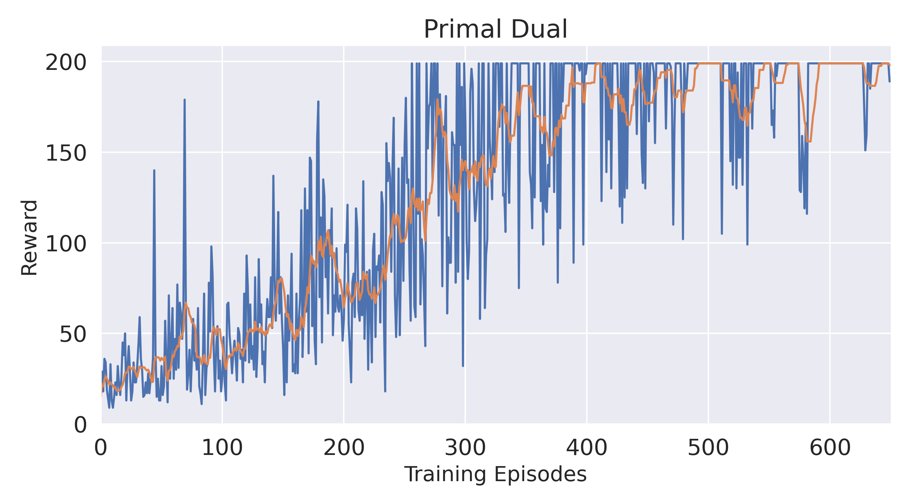
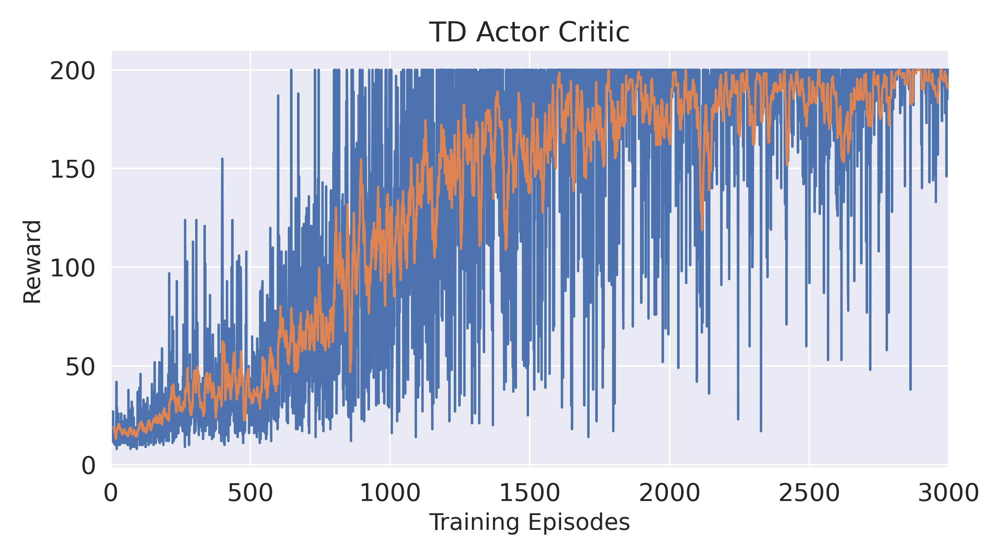

# Primal_Dual_RL

Result of our primal dual method (converges at 500 episodes)

Result of TD Actor Critic method (converges at 2000 episodes)

To run our code, simply use 
# Train
$ run `python primal_dual_stochastic.py` 
